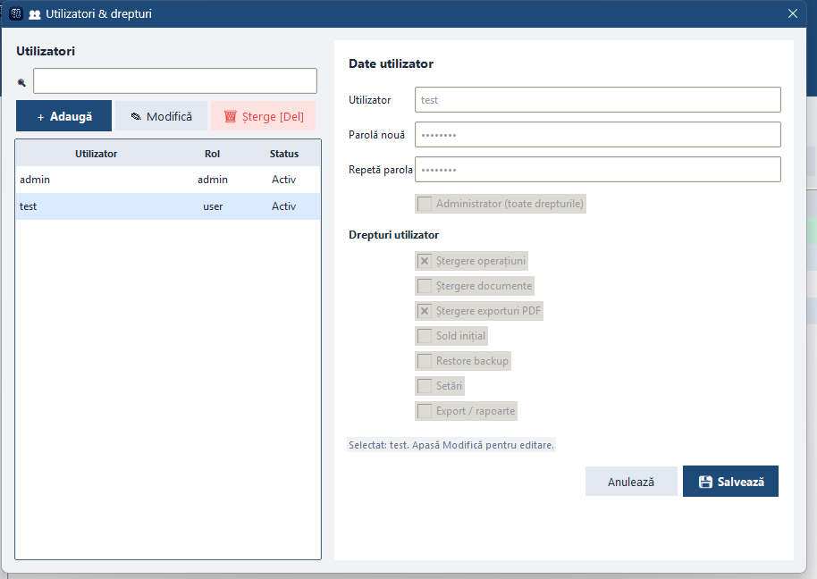
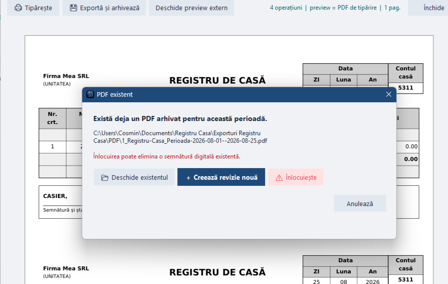
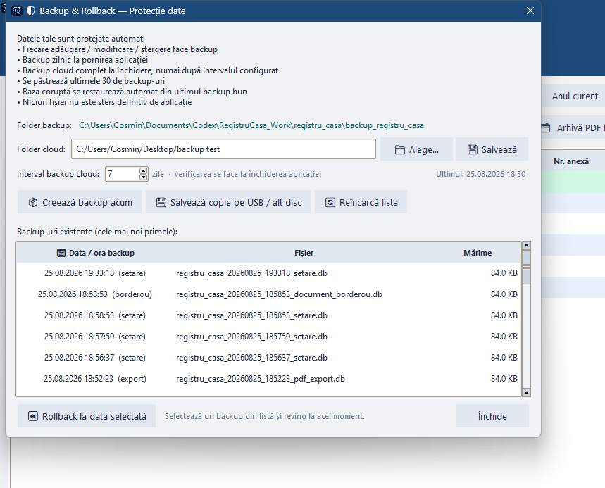
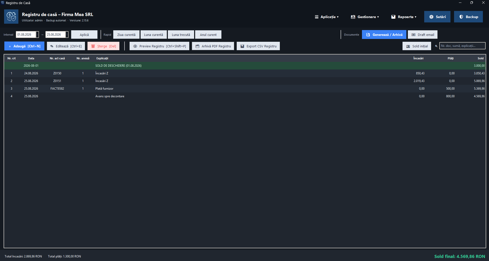

# Registru de Casă

Aplicație desktop pentru Windows destinată evidenței operațiunilor de casă, generării documentelor justificative și gestionării exporturilor PDF.

Proiect personal de software, dezvoltat incremental: de la un registru de bază la un set de module folosite în fluxul real al unei societăți comerciale.

  

## Obiectiv

Centralizarea înregistrărilor de casă, a documentelor generate și a arhivelor PDF într-o singură aplicație, cu reguli clare de backup și fără pierderea datelor la actualizare. Fluxul este orientat pe utilizarea zilnică: mai puține operații manuale între Excel, Word și sistemul de fișiere.

## Stack tehnologic

| Componentă | Tehnologie |
|------------|------------|
| Limbaj | Python 3 |
| Interfață | Tkinter / ttk |
| Bază de date | SQLite (mod WAL, pragmas de siguranță la scriere) |
| PDF | ReportLab (generare), PyMuPDF / fitz (vizualizare, manipulare) |
| Documente Office | python-docx (șabloane Word → completare → PDF) |
| Calendar UI | tkcalendar, babel, pytz |
| Imagini / iconițe | Pillow |
| Email | Gmail API, google-auth-oauthlib, google-api-python-client (OAuth Desktop) |
| Packaging | PyInstaller (distribuție Windows, one-dir) |
| Actualizare | `version.json` + GitHub Releases |

## Module

### 1. Registru de casă

- Încasări / plăți pe zile, sold rulant calculat automat
- Filtrare pe interval și preset-uri (zi, lună, an)
- Căutare, editare, confirmări la operații distructive
- Scurtături de tastatură pentru acțiunile frecvente

  

### 2. Utilizatori și drepturi

Acces pe bază de cont, cu roluri și drepturi pe operații sensibile (ștergere, restore, setări etc.). Modelul separă administrarea de operarea curentă a registrului.

  

### 3. Documente pe șabloane

Modulul de documente (borderouri bancă / cash / depuneri etc.) pornește de la **șabloane** Word predefinite. Utilizatorul completează câmpurile în interfața aplicației (date, sume, parteneri, text justificativ, rânduri de tabel etc.); aplicația mapează valorile pe template, generează documentul și produce un **PDF cu toate câmpurile completate**, pregătit pentru semnare și arhivare.

**Persistența valorilor:** conținutul formularului este salvat în baza de date SQLite (nu doar pe disc ca fișier). Dacă PDF-ul sau Word-ul dispar de pe disk, documentul poate fi **regenerat** din datele păstrate, fără reintroducere manuală a întregului conținut. Această alegere leagă modulul de documente de strategia generală de backup: fișierul e un artefact; sursa de adevăr pentru regenerare rămâne în bază.

### 4. Preview, tipărire și arhivă PDF

Preview-ul registrului folosește același conținut ca documentul tipărit. Arhiva PDF include numerotare, perioadă în denumire și management din interfață. Path-urile de documente pot fi expuse prin scurtătură pe Desktop, fără a lăsa fișierele neorganizate.

La conflict de nume (fișier deja existent), utilizatorul alege explicit dacă suprascrie sau anulează — evitând pierderi accidentale.

  
  &nbsp;
  

### 5. Protecția datelor

- Backup la modificări relevante (operațiuni, setări, documente)
- Backup zilnic la pornirea aplicației
- Copie pe folder sincronizat (ex. Google Drive, Digi Storage), la închidere sau după un interval configurat — fără stocarea credențialelor serviciului cloud în aplicație
- Limită pe numărul de backup-uri reținute
- Rollback la un punct din listă
- Încercare de restaurare automată dacă fișierul bazei pare corupt
- La update: baza, backup-urile, documentele și exporturile locale sunt păstrate

  

### 6. Email (Gmail)

Integrare prin **OAuth Desktop** (fără parolă Google în aplicație). Din modul se creează automat un **draft** în Gmail, cu PDF-urile selectate atașate. Utilizatorul completează destinatarul și restul mesajului, apoi trimite din Gmail. Nu există trimitere automată neconfirmată.

  

### 7. Interfață — temă întunecată (în lucru)

Suport pentru temă dark, în curs de rafinare (contrast, controale de dată, lizibilitate).

  

## Decizii de design (rezumat)

| Decizie | Motiv |
|---------|--------|
| SQLite local + WAL | Instalare simplă pe post de lucru, fără server obligatoriu; scrieri mai sigure la întreruperi |
| Șabloane Word + completare în UI → PDF | Document standardizat, gata de semnat, fără formatare manuală repetată |
| Câmpuri document în DB | Regenerare dacă fișierul dispare; aliniat cu backup-ul bazei |
| Backup pe evenimente + cloud pe folder sync | Protecție fără a introduce OAuth/parole de storage în app |
| Preview = PDF de tipărire | Același rezultat pe ecran și pe hârtie |
| Conflict PDF explicit | Control la suprascriere |
| Gmail OAuth + draft | Automatizare atașamente; trimiterea rămâne la utilizator |
| Update fără touch pe `.db` / documente | Instalările existente nu își pierd evidența |

## Repository

Repository-ul public conține documentație, metadate de versiune și pachetele de release pentru Windows. **Codul sursă complet nu este publicat aici.**

Excluded: baze SQLite, backup-uri, documente generate, token-uri și client secrets OAuth.

## Licență / uz

Proiect personal. Nu înlocuiește consultanța contabilă; procedurile trebuie adaptate firmei.

**Versiune curentă: 2.15.6**
