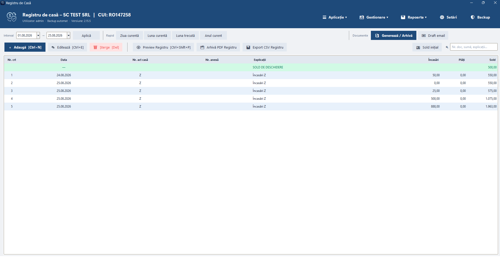

# Registru de Casă

Aplicație desktop pentru evidența operațiunilor de casă, generarea documentelor justificative și gestionarea exporturilor PDF.

## Captură de ecran

## Funcții principale

- **Registru de casă**: înregistrări zilnice, sold rulant, filtre rapide, căutare și preview
- **Documente**: borderouri bancă, cash și depuneri; PDF principal și Word regenerat la cerere
- **Arhivă PDF**: numerotare incrementală, perioadă, preview, locație și ștergere
- **Siguranța datelor**: backup local, backup înaintea migrării, rollback și backup cloud la interval configurabil
- **Utilizatori**: autentificare, roluri, drepturi și audit
- **Email**: selectarea documentelor, preview și creare de draft Gmail cu atașamente
- **Semnare**: deschiderea PDF-ului final în aplicația implicită și salvarea peste același fișier

## Tehnologii

- Python 3 și Tkinter / ttk
- SQLite în mod WAL
- ReportLab, python-docx, PyMuPDF și Pillow
- PyInstaller, distribuție Windows one-dir
- Gmail API cu OAuth Desktop pentru crearea drafturilor

## Actualizare și protecția datelor

Aplicația verifică `version.json` și descarcă pachetul publicat în GitHub Releases. La actualizare sunt păstrate baza clientului, backupurile, documentele și exporturile locale. Bazele vechi sunt copiate înaintea migrării și apoi aduse automat la structura curentă.

Bazele SQLite, backupurile, documentele generate și credențialele OAuth nu sunt incluse în repository sau în pachetul standard de actualizare.

## Cod sursă

Codul sursă este proprietar și nu este publicat în acest repository. Repository-ul este folosit pentru documentație, metadatele de versiune și distribuirea pachetelor Windows. Detalii: [SOURCE.md](SOURCE.md).

## Licență / uz

Aplicație cu utilizare privată. Nu înlocuiește consultanța contabilă; fluxurile trebuie adaptate procedurilor firmei.

Versiune curentă: **2.15.5**
