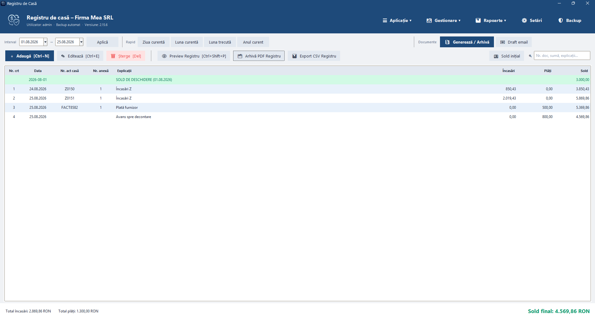
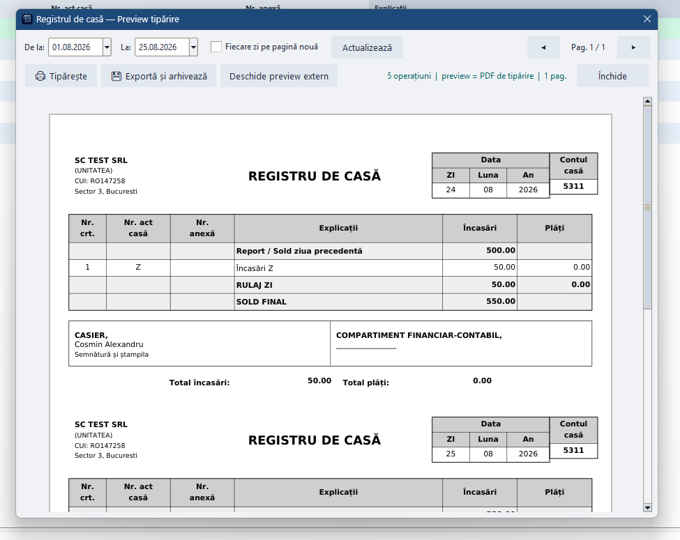
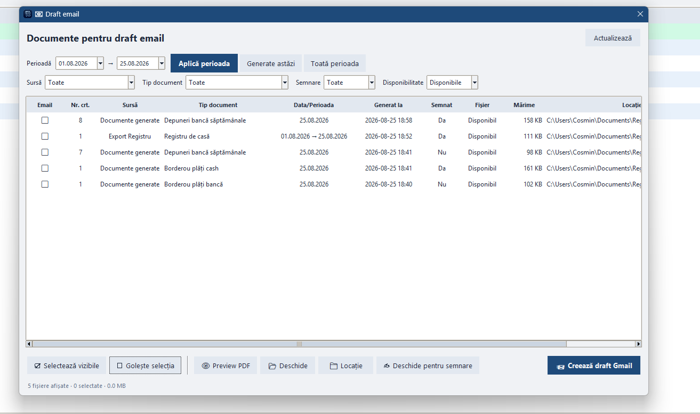

# Registru de Casă

Aplicație desktop Windows pentru evidența operațiunilor de casă, generarea documentelor justificative și organizarea PDF-urilor. Este un proiect personal construit incremental, de la un registru local la o arhitectură modulară cu backup, actualizare sigură și flux de documente.

**Release public curent: v3.0.0 — migrare PySide6 / Qt.** Release-ul rămâne punctul clar de revenire; modificările noi sunt validate înainte de un release ulterior.

<p align="center">
  
</p>

## Ce rezolvă aplicația

- registru de casă cu încasări, plăți, sold rulant și filtrare pe perioadă;
- documente pe șabloane (borderouri bancă, cash, depuneri), exportabile ca PDF și pregătite pentru semnare externă;
- arhivă unificată pentru PDF-uri, cu preview, localizare, semnare, ștergere controlată și selecție pentru email;
- dashboard pe interval: flux de numerar, mișcări importante, documente/exporturi și bilanț anual;
- backup, rollback și migrare automată pentru baze SQLite mai vechi;
- draft Gmail cu OAuth Desktop: utilizatorul atașează fișierele selectate și confirmă trimiterea în Gmail.

## Arhitectură

Versiunea Qt separă responsabilitățile pentru ca o schimbare de interfață să nu afecteze evidența contabilă:

```text
ui/          pagini, dialoguri, temă, iconițe și componente Qt
services/    documente, PDF, email, update și fluxuri de lucru
data/        SQLite, migrații și persistență
core/        configurare, căi, formatare, versiuni și bootstrap
tests/       verificări automate pentru fluxurile critice
```

UI-ul poate evolua fără rescrierea bazei, iar logica de documente/PDF poate fi testată fără fereastra grafică.

## Tehnologii

| Zonă | Tehnologie | Rol |
|---|---|---|
| Limbaj | Python 3 | ecosistem desktop și documente |
| UI | PySide6 / Qt | interfață scalabilă, tabele, calendare, dialoguri și dark mode |
| Bază locală | SQLite + WAL | fără server, scrieri consistente și backup simplu |
| PDF | ReportLab, PyMuPDF | generare, preview și verificare PDF |
| Documente | python-docx | șabloane Word și regenerare din date salvate |
| Email | Gmail API + OAuth Desktop | draft cu atașamente, fără parole Google în aplicație |
| Distribuție | PyInstaller | pachet Windows fără Python instalat |
| Actualizare | GitHub Releases + manifest | update fără înlocuirea datelor locale |

## Fluxuri importante

### Evidență și documente

1. Utilizatorul înregistrează o operațiune.
2. Registrul recalculează soldul și păstrează operațiunea în SQLite.
3. Documentele se completează în UI și devin PDF-uri din șabloane standardizate.
4. Formularul documentului rămâne salvat în bază; PDF-ul poate fi regenerat dacă dispare.
5. Fișierul apare în arhiva unificată, unde poate fi previzualizat, semnat extern sau adăugat într-un draft Gmail.

### Date și actualizări

- SQLite folosește WAL și scrieri sincronizate.
- Migrațiile extind baze vechi fără ștergerea datelor; înaintea migrării se păstrează o copie de siguranță.
- Update-ul exclude explicit baza `.db`, fișierele WAL/SHM, backup-urile, documentele utilizatorului și credențialele OAuth.
- Backup-urile sunt deliberate: pre-migrare, zilnic, manual, cloud la interval și înainte de rollback — nu redundante la fiecare click.

## Calitate și verificare

Proiectul include teste automate pentru migrare, backup, documente, rapoarte PDF, fluxuri Qt și siguranța actualizării. Modificările sunt verificate prin compilare și rularea suitei de teste înainte de pregătirea unui release.

## Capturi

<p align="center">
  
  
</p>

## Confidențialitate și sursa publică

Repository-ul public prezintă arhitectura, deciziile de proiectare, capturi și release-uri Windows. Nu include baza de date, backup-uri, documente generate, token-uri OAuth sau sursa completă a produsului.

## Licență / uz

Proiect personal demonstrativ. Nu înlocuiește consultanța contabilă; utilizarea concretă trebuie adaptată procedurilor firmei.

